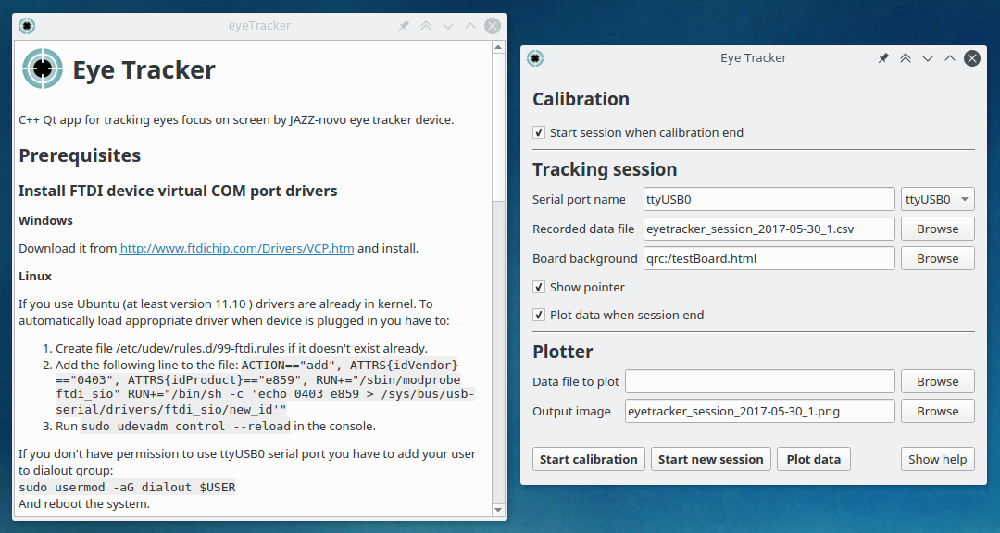

# Eye Tracker  

C++ Qt app for tracking eyes focus on screen by JAZZ-novo eye tracker device. 

**Version** 0.1-alpha

 

## Compilation

You can compile program by Qt Creator with GCC (under Linux) or MSVC (under Windows) compiler.

## Prerequisites

### Install FTDI device virtual COM port drivers

#### Windows

Download it from http://www.ftdichip.com/Drivers/VCP.htm and install.

#### Linux

If you use Ubuntu (at least version 11.10 ) drivers are already in kernel. To automatically load appropriate driver when device is plugged in you have to:

1. Create file `/etc/udev/rules.d/99-ftdi.rules` if it doesn't exist already.
2. Add the following line to the file `ACTION=="add", ATTRS{idVendor}=="0403", ATTRS{idProduct}=="e859", RUN+="/sbin/modprobe ftdi_sio" RUN+="/bin/sh -c 'echo 0403 e859 > /sys/bus/usb-serial/drivers/ftdi_sio/new_id'"`.
3. Run `sudo udevadm control --reload` in the console.

If you don't have permission to use `ttyUSB0` serial port you have to add your user to `dialout` group:

`sudo usermod -aG dialout $USER`

And reboot the system.

## How to use

Firstly, calibrate device input by clicking `Start calibration` button and follow calibration procedure described below. If you go through calibration with success you can start new tracking session by clicking the `New session` button, but before you must enter needed information in configuration form. 

## Calibration

`Start calibration` button allows you to enter calibration mode. In this mode application shows calibration board stretched to screen resolution. Calibration procedure is to follow your eyes markers starting from top left, then stop on each one and hit space key on your keyboard. Correct order of markers to focus your eyes on is as follows: 

1. Top left 
2. Center 
3. Bottom right 
4. Bottom left
5. Center again 
6. Top right

You can exit this mode by hitting `ESC` key on keyboard. 

## Session

`Start new session` button allows entering session mode where you can see red dot on screen in the position of your eyes focus if the calibration is successful. On screen there is also displayed your test board chosen in the configuration as background. 
You can exit this mode by hitting `ESC` key on keyboard. 

### Session configuration 

| Field                  | Description                              |
| ---------------------- | ---------------------------------------- |
| **Serial port name**   | Name of serial port to which device is connected. Next to text field are listed detected ports and most likely ones like COM3 on Windows or ttyUSB0 on Linux. |
| **Recorded data file** | Path of file where you want to log all data of eye position recorded during session. |
| **Board background**   | Link to website e.g. http://google.com, or local html file. You can also use default build in test board with one column of text: qrc:///testBoard.html . |